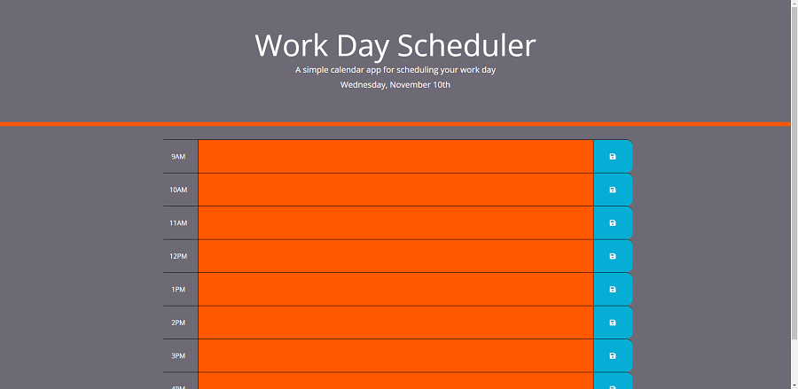
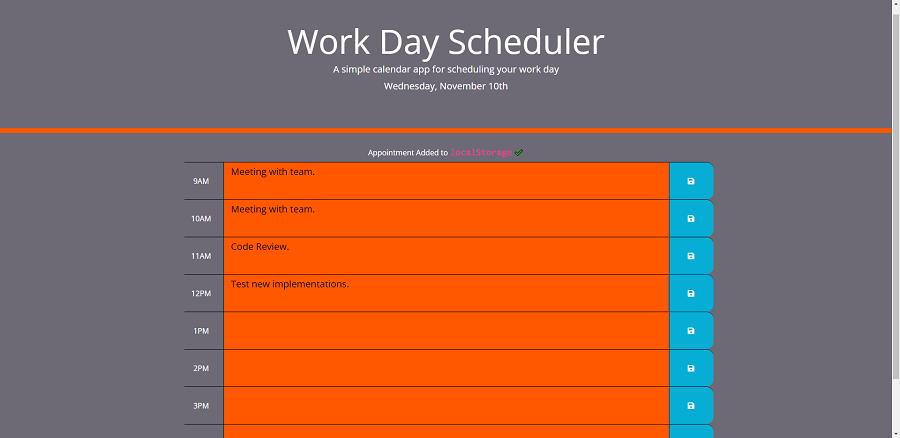

# Work-Schedule-Planner
This is a daily work schedule planner. I designed it to have one-hour intervals, making it easy for you to schedule events throughout your workday. Click in the orange text area next to the hour you would like to schedule an event for. Once you have typed the event, you would like to schedule click on the save icon within the blue box next to the hour you just scheduled an event in. After you have saved an event, a message will appear above the first hour, signaling that it has saved your event.

## Table of Contents
- [Installation](#installation)  
- [Usage](#usage)  
- [Project Links](#project-links)  
- [Credits](#credits)  
- [License](#license)

### Installation
To install this application, simply clone this repository. If you would like to view the application locally, I would recommend downloading an extension that allows you to view code in your default browser. If you are using Visual Studio Code, I recommend the "open in browser" extension by “TechER”.

### Usage
After you have cloned the repository and downloaded an extension you will be able to open and view the application locally.

#### Links

##### Project Links:
- [Deployment from GitHub Pages](https://cameronheadlee.github.io/Work-Schedule-Planner/)  
- [GitHub Repository](https://github.com/CameronHeadlee/Work-Schedule-Planner)

##### Screenshots of application:
- Image of application on open. 
   
- Image of saved events. 

## Credits
This application was built using:
- HTML5  
- JavaScript  
- CSS3  
- [moment.js](https://momentjs.com/)

## License
This application is licensed under MIT   

## Questions
If you have any questions or suggestions on improvements please email me:    
- [Email](mailto:camhcodes11@gmail.com)    
Checkout my other projects:      
- [GitHub](https://github.com/CameronHeadlee?tab=repositories)
